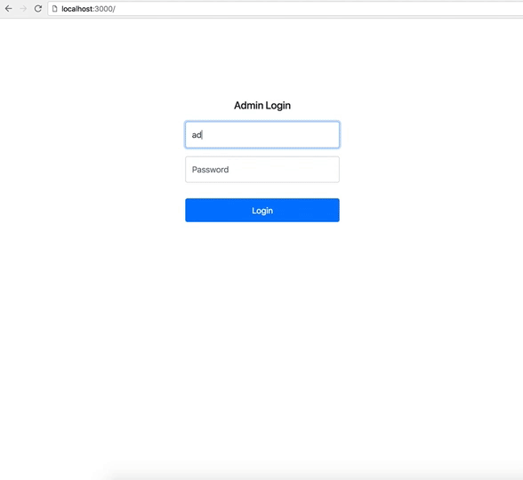
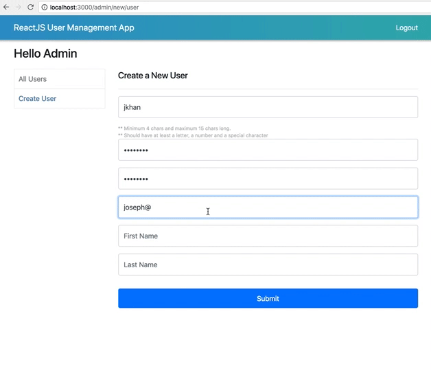
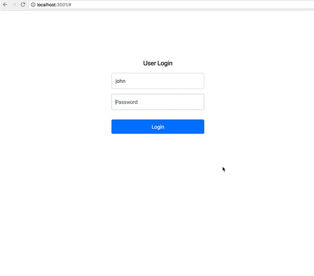

# Project Title

React Simple User Management App

## Description
Simple User Management App created with React JS. Has the following features
1. Authenticating user with username and password
2. Create, update, and delete user
3. See the user detail

This demo uses fake json-server data to create, update, delete and authenticate users. This repository has 3 folders,
* admin-app : The Admin Management App interface. Admin can create, view, update and delete users. This app was created using [create-react-app](https://github.com/facebook/create-react-app) starter kit
* user-app : The User App interface. User can only login and see his details. For simplicity of the demo, the actions are restircted. This app was created using [create-react-app](https://github.com/facebook/create-react-app) start kit.
* fake-server : fake json-server folder which has a db.json file. All related data are inside the json file. Read more about json-server [here](https://github.com/typicode/json-server).

### Prerequisites

* NodeJS v6.10.3 and up - Install Node JS from its [download page](https://nodejs.org/en/download/).
* NPM (Node package manager) - npm is installed along with NodeJS. My version at the time of commit was v6.0.1.
* yarn - yarn is considered faster than npm. If you do not want to use npm commands then you can use yarn. Installation instructions can be found [here](https://yarnpkg.com/lang/en/).

## Getting Started and Installing

These instructions will get you a copy of the project up and running on your local machine for development and testing purposes. See deployment for notes on how to deploy the project on a live system.

* First Git clone the repo into your computer
```
git clone https://github.com/jsphkhan/react-user-management-app.git
```
The cloned repository/folder has 3 folders inside it as described above.

### Running the json-server
* First install the json-server (if you do not have it already) to use the REST interface that is used by the applications.
```
$ npm install -g json-server
```
* And then start the server to bring up the REST interface. Please note that my server runs on port 3002. You can change this in the command, but the same thing also needs to be changed inside admin-app/src/config/config.js or user-app/src/config/config.js to update the port.
```
$ cd fake-server
$ json-server --watch db.json --port 3002
```

### Running the Admin App
* Open your terminal
```
$ cd admin-app
$ npm install
```
* This should install all the dependencies. Once done
* Run 
``` 
$ yarn start
or
$ npm start
```
* to start the server.
* open (http://localhost:3000) in your browser. 
* This should open up the Admin App
* Use this account to login. (admin/admin@123)

### Running the User App
* Open your terminal
```
$ cd user-app
$ npm install
```
* This should install all the dependencies. Once done
* Run 
``` 
$ yarn start 
or 
$ npm start
```
* to start the server.
* open (http://localhost:3001) in your browser. User App is configured to run in port 3001. If you want to change, you can do so inside package.json
```
"scripts": {
    "start": "PORT=3001 react-scripts start"
 }
```
* This should open up the User App
* There are already few fake users created. You can login with one of them (john/yahoo@123). You can see all of them inside the fake-server/db.json file.
* You can create more users from the Admin App and then login inside the User App.


### Demo

#### Admin App
###### Admin Login


###### Create User


#### User App



## Running the tests
-- Open for improvement --

## Deployment
#### Generating Production build for admin-app
```
$ cd admin-app
$ npm run build
or
$ yarn build
```

#### Generating Production build for user-app
```
$ cd user-app
$ npm run build
or
$ yarn build
```
Builds both the apps for production into their respective build folders.
It correctly bundles React in production mode and optimizes the build (eg. admin-app/build) for the best performance.

#### Deployment to live server (eg. Heroku)
In progress

## Built With

* [create-react-app](https://github.com/facebook/create-react-app) - The React JS starter kit used.
* [bootstrap](https://getbootstrap.com/) - CSS library.
* [react-router-dom](https://github.com/ReactTraining/react-router) - For routing and navigation.

## Contributing

Please read [CONTRIBUTING.md](https://github.com/jsphkhan/react-user-management-app/blob/master/Contributing.md) for details on the process of submitting a pull request.

## Known Issues/Limitations

* Lacks a proper authentication and authorization model. json-server is a fake REST API server and as such its functionalities are limited. This can be improved when used with a proper NodeJS backend.
* The intention of this project is to create a React boilerplate that can be used for learning purpose.
* 

## Authors

* **Joseph Khan** - (https://github.com/jsphkhan)

## License

This project is licensed under the MIT License - see the [LICENSE.md](LICENSE.md) file for details
